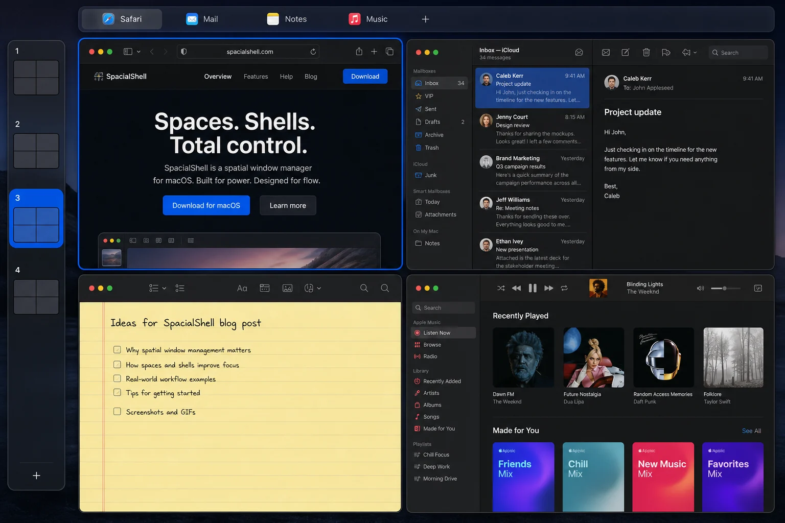
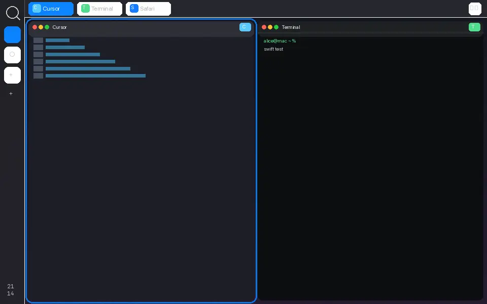
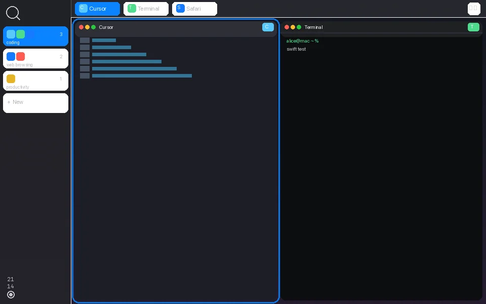

# SpacialShell

  

A spatial window manager for macOS: workspaces stacked vertically, windows arranged horizontally,
every window has one address.

  

## What it is

SpacialShell reimplements the GNOME **material-shell** paradigm on macOS. material-shell itself is
discontinued; its authors moved on to **Veshell**, a Wayland compositor whose specifications carry
the same thesis further. SpacialShell is the continuation of that lineage on macOS — not a port of
either project, and no code is shared with them.

The idea: every workspace is a row of apps. Open a new app and it lands at the end of the current
row. Add a workspace and it appears underneath. Up/down moves between workspaces, left/right
between windows, and windows are always tiled, never overlapping — there is never any doubt where
a window went. Veshell calls this a **"not-desktop"**: a place you inhabit rather than a desktop
you tidy.

M1 is the headless spatial core. **M2** is the face: a left workspace rail, a top window tab bar,
five tiling layouts, and a focus glow that lands on the tile.

  

## The model

  

A **workspace** is a row. An **application** is a cell. New windows append to the current row;
new workspaces append underneath. Navigate **up/down** to change workspace, **left/right** to
change window. The screen is a viewport over a larger, always-sorted grid.

- **Single address.** Every managed window lives in exactly one workspace of exactly one screen —
  never two places, never none.
- **New windows append.** A window that appears lands at the end of the active workspace on the
  screen it mostly overlaps; a dialog joins its owner's workspace right after it.
- **New workspaces append.** A freshly created workspace always goes to the bottom of its screen's
  stack.
- **There's always a way down.** Each screen's stack ends with one empty workspace, so "down" is
  always meaningful; once it gains a window a fresh empty one appears below it, and empty
  workspaces in the middle disappear on their own — except pinned ones (seeded from config), which
  stick around even empty so named categories survive before windows do.
- **Focus is always somewhere real.** The focused window is always in the active workspace of the
  focused screen, or is a floating "visitor" window that belongs to no workspace at all.

## Interface

  

Two panels, one job: show *where you are*.

- **System panel** (left rail, 48 pt): search, workspace tiles, `+`, stacked clock. Click a tile
  to go there.
- **Workspace panel** (top bar, 34 pt): a tab per window on the active row, plus the layout
  switcher.
- **Focus glow**: a 3 pt accent stroke at the window's *desired* frame — it arrives before the
  window does.

## Layouts

  

`Fn+Space` cycles them: **maximize** · **split** · **column** · **half** · **grid**.

## Status

**M1 — spatial core**, shipped and running (headless). Screen/workspace/window model and its
invariants, all five tiling layouts, the full hotkey set under two presets, TOML config with live
reload, JSON state persistence for pinned workspaces, window classification (tiled / floating /
ephemeral / ignored), and parking.

**M2 — shell UI**, in progress. Landed so far: the `ScreenPanel` workspace rail (one button per
workspace, the trailing empty one drawn as "+", search glyph opening the configured launcher), the
`WorkspacePanel` tab bar + layout switcher (one tab per window in the active row, in `Fn+A`/`Fn+D`
order), **Zen mode** on `Fn+Esc` (hides both panels and gives their edges back to the layout;
survives relaunch), a built-in **overview** on `Fn+Tab` (search over open windows and installed
apps — the fallback when `launcher-url` has no handler), a **hold-`Fn` cheat sheet** showing your
live bindings, `Fn+,` opening the config file, and the control surface: unix-socket IPC,
`spacialctl`, and the Raycast extension under [`raycast/`](raycast/). Panels are Apple-native
materials, never take key focus (the overview's search field is the one exception), and every
click re-enters the same command pipeline as a hotkey. Still to come: the focus glow, `Fn+Drag`
reordering, workspace rename/menus, and window titles in tabs (app name + icon until then).

Loops are served as animated **webp** (and **gif** next to them) from
[`docs/media/`](docs/media/). Regenerate with `Scripts/render-m2-media.py`.

## Install

1. Grab a DMG from [Releases](https://github.com/AskAlice/alice-material/releases), or build the
   app bundle: `Scripts/bundle.sh`. That produces `build/SpacialShell.app`, ad-hoc signed with a
   stable bundle id (`me.askalice.SpacialShell`) so the Accessibility grant survives rebuilds.
   Tag `v*` (or run **Release** from Actions) to rebuild, run unit tests, and publish a DMG.
2. Move `build/SpacialShell.app` to `/Applications` (or anywhere you like — just keep it in place
   afterwards; moving it invalidates the grant, see below).
3. Launch it. On first launch SpacialShell asks for the **Accessibility** permission and opens
   System Settings → Privacy & Security → Accessibility for you; tick the checkbox next to
   SpacialShell and it continues on its own.
4. That's it — no menu bar UI in M1, and no Dock icon (it runs as an accessory app), so there is no
   `⌘Q` to quit with, and `Fn+Q` with no window focused is simply a no-op, not a quit shortcut.
   Quit with `Ctrl-C` if you're running the dev binary in a terminal, or `kill`/SIGTERM otherwise —
   either one runs the termination gate: state is saved, every managed window is restored to the
   centre of its screen, then the process exits.

**Development**: `Scripts/dev.sh` builds debug and runs `.build/debug/SpacialShell` in the
foreground. Its TCC identity is the raw binary **path**, so the Accessibility grant is tied to that
exact path and has to be re-granted if you move or rename the checkout — see `Scripts/README` for
the full explanation and `SPACIAL_LOG_KEYS=1 Scripts/dev.sh` for hotkey debugging.

## Hotkeys

`Fn`/Globe is the default modifier (Super-equivalent); `⌃⌥` is the preset for keyboards without a
Globe key (`keybinding-preset = "ctrl-alt"` in config). The four arrow-key pairs are bound to
`⌃⌥` in **both** presets — `Fn+arrows` are Home/End/Page Up/Page Down system-wide on Apple
keyboards and can never be bound.

| Command | `fn` preset | `ctrl-alt` preset |
|---|---|---|
| Focus workspace up / down | `Fn+W` / `Fn+S` | `⌃⌥W` / `⌃⌥S` |
| Focus window left / right † | `Fn+A` / `Fn+D` | `⌃⌥A` / `⌃⌥D` |
| Focus workspace 1…10 | `Fn+1` … `Fn+0` | `⌃⌥1` … `⌃⌥0` |
| Close focused window | `Fn+Q` | `⌃⌥Q` |
| Move window left / right | `Fn+⇧A` / `Fn+⇧D` | `⌃⌥⇧A` / `⌃⌥⇧D` |
| Move window to workspace up / down | `Fn+⇧W` / `Fn+⇧S` | `⌃⌥⇧W` / `⌃⌥⇧S` |
| Cycle layout | `Fn+Space` | `⌃⌥Space` |
| Toggle shell panels (Zen mode) | `Fn+Esc` | `⌃⌥Esc` |
| Open overview / launcher | `Fn+Tab` | `⌃⌥Tab` |
| Open the config file | `Fn+,` | `⌃⌥,` |
| Focus screen prev / next | `Fn+[` / `Fn+]` | `⌃⌥[` / `⌃⌥]` |
| Move window to screen prev / next | `Fn+⇧[` / `Fn+⇧]` | `⌃⌥⇧[` / `⌃⌥⇧]` |
| Toggle float | `Fn+G` | `⌃⌥G` |
| Focus window / move window (arrows) | `⌃⌥←→↑↓` / `⌃⌥⇧←→↑↓` | `⌃⌥←→↑↓` / `⌃⌥⇧←→↑↓` |

† Window focus walks every *visible* window in the active workspace, floating ones included —
a floating window keeps its index in the row even though it takes no tiling slot. Minimized and
hidden windows are skipped, and ephemeral "visitor" windows are in no row at all (spec §4.3).

`Fn+F` is deliberately **unbound** — Globe+F is Apple's own full-screen shortcut, and SpacialShell
does not fight macOS for it. All chords are configurable — see [`docs/keybindings.md`](docs/keybindings.md)
for the cheat-sheet, presets, rebinding recipes and known conflicts, and `docs/config.md` for the full reference.

## Known limitations

- **One native macOS Space per display.** Workspaces are emulated by parking inactive windows in a
  screen corner, not by native Spaces — SIP stays on and there's no scripting addition to
  reinstall on every OS update.
- **Mission Control and `⌘Tab` see parked windows.** Because parking is a corner-of-the-screen
  trick rather than a real Space switch, the OS's own window-switching UI shows windows that
  SpacialShell has tucked away.
- **`Fn+letter` may conflict with macOS's own symbolic hotkeys** (Quick Note, Show Desktop, Dock,
  Type-to-Siri, and friends). Whether the session-level hotkey tap wins that race is an open
  empirical question — see `docs/platform-notes.md` (currently `pending grant`) — and if it
  doesn't, the shipped default preset may become `ctrl-alt` instead of `fn`.
- **Non-Apple keyboards never deliver a real `Fn` key press** — the modifier lives in firmware and
  the HID layer never sees it. Use Karabiner-Elements (which re-emits through a virtual Apple
  keyboard) or the `ctrl-alt` preset instead.
- **The shell UI is young.** The rail, tab bar, and overview are in; the focus glow and `Fn+Drag`
  reordering are not yet, and tabs show app names, not window titles. `show-panels = false` in
  config brings back the panel-less behaviour (the overview and `spacialctl` stay).

## Licence and attribution

SpacialShell is licensed under the GNU General Public License v3.0 (GPL-3.0) — see `LICENSE`.

Its Accessibility/platform layer harvests MIT-licensed code from
[AeroSpace](https://github.com/nikitabobko/AeroSpace) (Copyright (c) 2023 Nikita Bobko); the full
licence text ships in `legal/third-party/LICENSE-AeroSpace.txt`, every adapted file carries an
"Adapted from AeroSpace" header, and `NOTICE` lists them all. The spatial paradigm itself — the
workspace-as-row model, the "not-desktop" framing — is design inspiration from GNOME material-shell
and Veshell (both GPL-3); no code from either was used.
