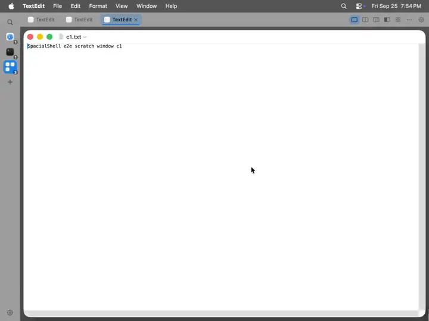
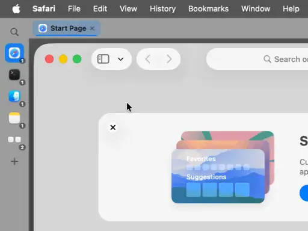
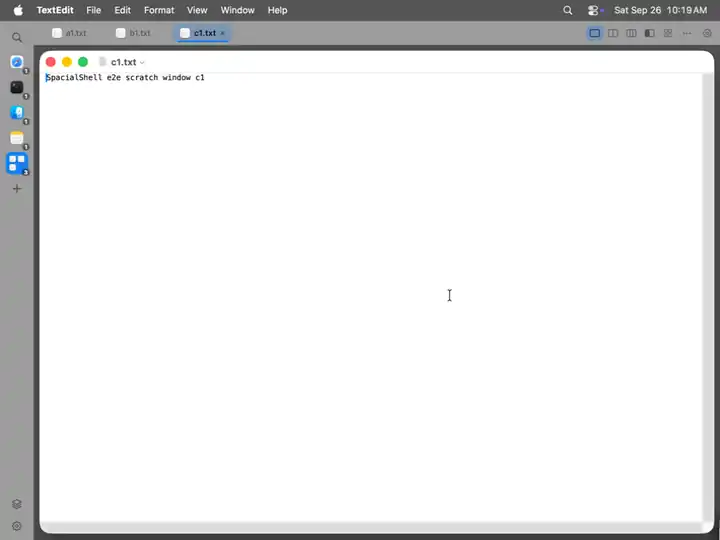
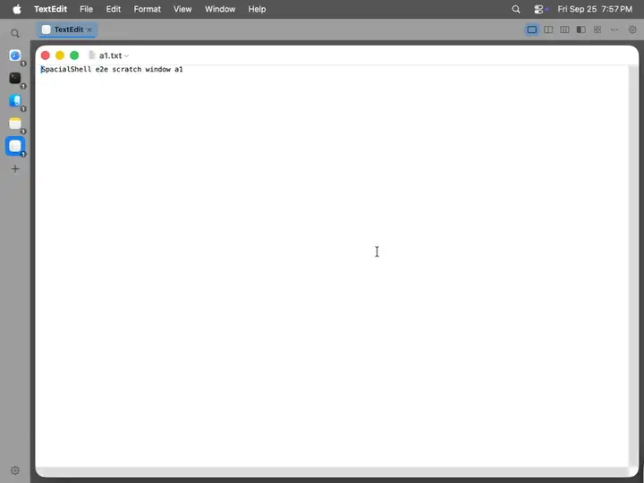
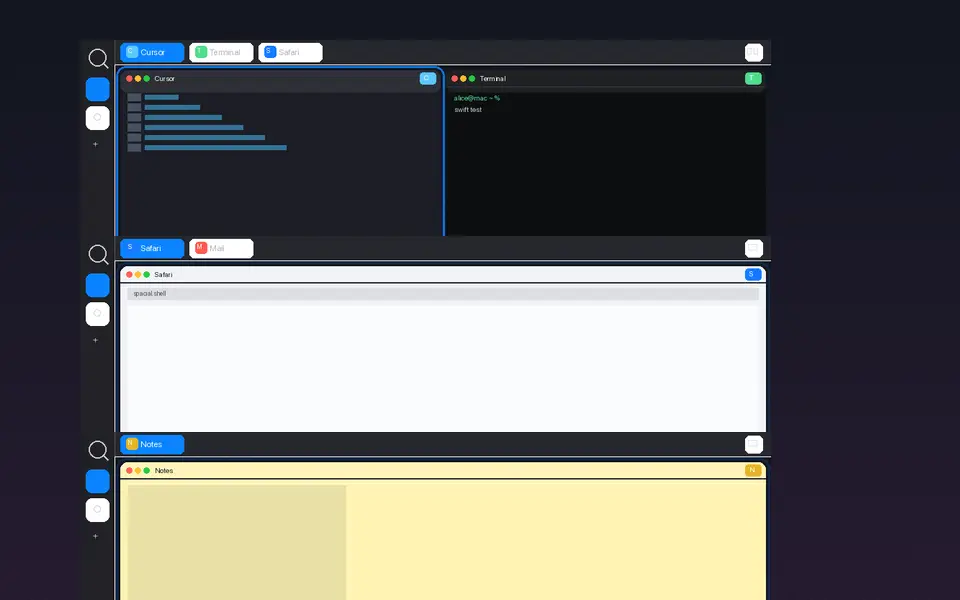
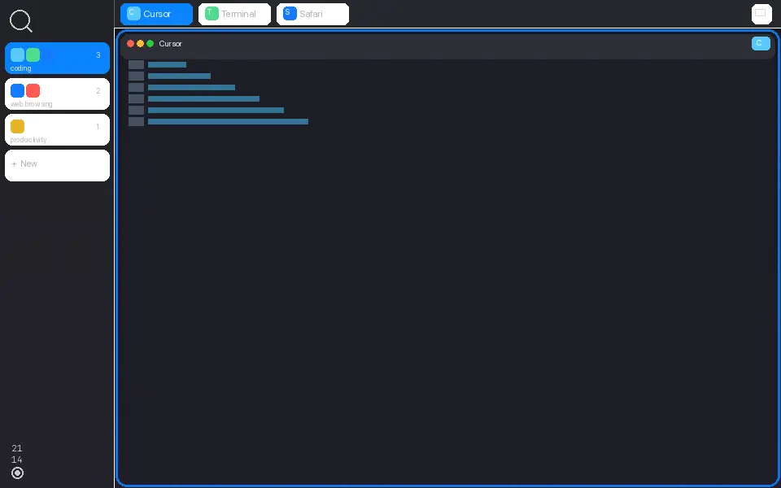

# SpacialShell

**material-shell's spatial desktop, on the Mac.** A tiling window manager for macOS where every
window has one address, you move by direction, and the shell remembers where you put things.

<p align="center">
  <a href="#get-started"><b>Get started</b></a> ·
  <a href="#install">Install</a> ·
  <a href="#build-from-source">Build</a> ·
  <a href="CONTRIBUTING.md">Contributing</a> ·
  <a href="https://askalice.github.io/SpacialShell-MacOS/">Docs site</a> ·
  <a href="docs/keybindings.md">Keybindings</a> ·
  <a href="docs/config.md">Config</a> ·
  <a href="docs/ipc.md">spacialctl</a>
</p>

<p align="center">
  
</p>
<p align="center"><sub>Live capture: <code>Fn+Space</code> through the layouts, <code>Fn+D</code>/<code>Fn+A</code> along the row, <code>Fn+W</code>/<code>Fn+S</code> between rows.</sub></p>

## Get started

```sh
brew install --cask askalice/tools/spacialshell
```

Launch it, grant **Accessibility** when asked, and press `Fn+S`. Hold `Fn` on its own for a cheat
sheet of every binding. More in [Install](#install).

## Why it exists

Your brain is already a very good window manager, if you give it a *place* to work with.
**Spatial memory** is how you know where the mugs are in your own kitchen; **mental mapping** is
how you plan a route through a place you know. A pile of overlapping windows gives neither anything
to hold on to. A stable grid gives them everything.

So SpacialShell lays your apps out in two dimensions — **every workspace is a row, every window a
cell** — grouped by use case: browsers on one row, editor and terminal on the next, media below. It
**remembers** that arrangement as you use it, with nothing to configure. You **move by direction**,
like in a game world: `Fn+W`/`Fn+S` between rows, `Fn+A`/`Fn+D` along one. And the rail and tab
bar **show the whole map at a glance**, so the mouse works as well as the keyboard. Finding a window
stops being a search and becomes wayfinding.

This is the paradigm of GNOME's [**material-shell**](https://github.com/material-shell/material-shell)
and its successor [**Veshell**](https://github.com/free-explorers/veshell) — a "not-desktop" you
inhabit rather than tidy. SpacialShell is that lineage **rebuilt for macOS, not Linux**: not a port
and no shared code, under the same GPL-3.0.

### Built on Apple's terms

Both of those projects own the compositor. On a Mac nobody does, which shapes everything here:

- **The public Accessibility API instead of a compositor** — the same interface screen readers use.
- **Screenshot-proxy animations** — switches slide *pictures* of the windows, then move the real
  ones once, because macOS has no hooks for animating another app's window.
- **Beside Spaces, fullscreen and the menu bar**, not replacing them; an app can't drag you out of a
  fullscreen Space by stealing focus.
- **No private APIs, SIP stays on** — nothing to reinstall after a macOS update.
- **Notarised, outside the App Store** — the App Store sandbox forbids the control a tiler needs.
- **Native look** — vibrancy materials, your accent colour, light/dark from System Settings.

## Live captures

Recorded in the test VM (one 1024×768 display) while a scenario drives the real shell through
`spacialctl` and synthetic input: `Scripts/e2e/e2e.sh --vm --suite media`, then
`Scripts/e2e/media.sh`. Multi-display features aren't in these; they need a real multi-monitor Mac.

<p align="center">
  
</p>
<p align="center"><sub>The rail with real apps, each in the row its category sends it to; hover cards with live previews.</sub></p>

<p align="center">
  
</p>
<p align="center"><sub>A tab dragged along the bar, then onto a workspace in the rail, which moves its window there.</sub></p>

<p align="center">
  
</p>
<p align="center"><sub>Settings, opened with <code>Fn+,</code>: General, Appearance, Layout, Workspaces, Keybindings.</sub></p>

## The model

<p align="center">
  
</p>
<p align="center"><sub>Render, not a live capture.</sub></p>

A **workspace** is a row; an **application window** is a cell. New windows append to the current
row, new workspaces append underneath. **Up/down** changes workspace, **left/right** changes
window. The screen is a viewport over a larger, always-sorted grid.

- **Single address.** Every managed window lives in exactly one workspace of exactly one display.
- **There's always a way down.** Each display's stack ends with one empty workspace; empty rows in
  the middle disappear on their own.
- **Per-display stacks.** Every display has its own rail; a window (`Fn+⇧+arrows`) or a whole
  workspace (`Fn+⌥⇧+arrows`) can move to the display that way.
- **Categories are identity.** The rail shows what each row *is* — web, terminal, coding, media —
  and `category-order` gives each category its own row, so a new browser window lands with the
  other browsers.
- **Placement memory.** Windows go back to their workspace and display across restarts (displays
  matched by UUID), and nothing is ever left invisible: every window the shell lists is one click
  away, and parked windows are recovered after a crash.

## Interface and layouts

<p align="center">
  
</p>
<p align="center"><sub>Render, not a live capture.</sub></p>

- **The rail** (left): one row per workspace with its apps and category, hover previews, a tray
  for hidden and minimized windows, right-click menus (quit an app, set a row's category), scroll
  to switch, and Dock-style auto-hide.
- **The tab bar** (top): a tab per window, drag to reorder or onto a rail row, right-click for
  Close / Float / Move to workspace, middle-click to close; plus the layout switcher.
- **Layouts:** `Fn+Space` cycles **maximize** · **split** (an N-column sliding view) · **column** ·
  **half** · **grid**. Draw your own in the layout editor or as `[[layout]]` blocks.
- **Resize:** drag a border, or `Fn+⌃A/D/W/S` in 5% steps that stop on 25/50/75%; `Fn+⌃=`
  balances. Sizes are kept per workspace and per layout.
- Hold `Fn` for the cheat sheet, `Fn+Tab` for the overview, `Fn+Esc` for Zen mode.

## Hotkeys

`Fn`/Globe is the default modifier; `⌃⌥` is the preset for keyboards without a Globe key
(`keybinding-preset = "ctrl-alt"`). The grammar: **Fn** navigates, **+⇧** moves the window, **+⌃**
resizes, **+⌥** reaches displays or the whole app.

| Command | `fn` preset | `ctrl-alt` preset |
|---|---|---|
| Focus workspace up / down | `Fn+W` / `Fn+S` | `⌃⌥W` / `⌃⌥S` |
| Focus window left / right | `Fn+A` / `Fn+D` | `⌃⌥A` / `⌃⌥D` |
| Focus workspace 1…10 (again to go back) | `Fn+1` … `Fn+0` | `⌃⌥1` … `⌃⌥0` |
| Focus tab 1…9 | `Fn+⌥1` … `Fn+⌥9` | — |
| Move window left / right | `Fn+⇧A` / `Fn+⇧D` | `⌃⌥⇧A` / `⌃⌥⇧D` |
| Move window to workspace up / down / N | `Fn+⇧W` / `Fn+⇧S` / `Fn+⇧1…0` | `⌃⌥⇧W` / `⌃⌥⇧S` / — |
| Move every window of the app up / down | `Fn+⌥⇧W` / `Fn+⌥⇧S` | — |
| Resize narrower / wider / shorter / taller | `Fn+⌃A` / `D` / `W` / `S` | `⌃⌥⌘A` / `D` / `W` / `S` |
| Balance sizes | `Fn+⌃=` | `⌃⌥⌘=` |
| Focus display that way | `Fn+⌥W/A/S/D` | — |
| Move window / workspace to display that way | `Fn+⇧+arrows` / `Fn+⌥⇧+arrows` | — |
| Focus / move to display prev, next | `Fn+[` `Fn+]` / `Fn+⇧[` `Fn+⇧]` | `⌃⌥[` `⌃⌥]` / `⌃⌥⇧[` `⌃⌥⇧]` |
| Cycle layout / backwards | `Fn+Space` / `Fn+⇧Space` | `⌃⌥Space` / `⌃⌥⇧Space` |
| Toggle float | `Fn+G` | `⌃⌥G` |
| Close focused window | `Fn+Q` | `⌃⌥Q` |
| Zen mode / overview / config file | `Fn+Esc` / `Fn+Tab` / `Fn+,` | `⌃⌥Esc` / `⌃⌥Tab` / `⌃⌥,` |

`Fn+F` is deliberately unbound — Globe+F is Apple's full-screen shortcut. Every chord can be
rebound in `config.toml` or Settings; see [`docs/keybindings.md`](docs/keybindings.md).

## Install

1. `brew install --cask askalice/tools/spacialshell`, or download the notarised DMG from
   [Releases](https://github.com/AskAlice/SpacialShell-MacOS/releases) and move
   `SpacialShell.app` to `/Applications`. Keep it where you put it: moving it invalidates the
   Accessibility grant.
2. Launch it. It asks for **Accessibility** and opens System Settings → Privacy & Security →
   Accessibility; tick SpacialShell and it continues on its own.
3. *Optional:* hover previews and sliding switches need **Screen Recording**; the hover card offers
   it when it matters. Restart SpacialShell after granting it. Without it, switches are instant and
   everything else works.
4. Quit from the rail's app menu. Quitting restores every managed window to the centre of its
   screen and saves your layout.

## Build from source

Requires macOS 14+ and a Swift 6 toolchain (Xcode 16 or later).

```sh
git clone https://github.com/AskAlice/SpacialShell-MacOS.git && cd SpacialShell-MacOS
swift test          # the gate for every change
Scripts/dev.sh      # build debug and run in the foreground
Scripts/bundle.sh   # build/SpacialShell.app, signed with a stable identity
```

`Scripts/dev.sh` runs the raw binary, whose Accessibility grant is tied to its path; see
[`Scripts/README`](Scripts/README) for the TCC details and `SPACIAL_LOG_KEYS=1` for hotkey
debugging. `make hooks` installs the pre-commit hook. [CONTRIBUTING.md](CONTRIBUTING.md) has the
rest.

## Known limitations

- **One native macOS Space per display.** Workspaces are emulated by parking inactive windows, not
  by native Spaces, so Mission Control and `⌘Tab` can still see parked windows.
- **Non-Apple keyboards never send `Fn`.** Use the `ctrl-alt` preset or Karabiner-Elements.
- **Some `Fn+letter` chords collide with macOS's own shortcuts.** The keyboard hook runs at the
  HID level to win that race; see [`docs/keybindings.md`](docs/keybindings.md) for known conflicts.

## Licence and attribution

SpacialShell is licensed under the GNU General Public License v3.0 (GPL-3.0) — see `LICENSE`.

Its Accessibility/platform layer adapts MIT-licensed code from
[AeroSpace](https://github.com/nikitabobko/AeroSpace) (Copyright (c) 2023 Nikita Bobko); the licence
ships in `legal/third-party/LICENSE-AeroSpace.txt`, every adapted file carries an attribution
header, and `NOTICE` lists them all. The spatial paradigm is design inspiration from
[material-shell](https://github.com/material-shell/material-shell) and
[Veshell](https://github.com/free-explorers/veshell) (both GPL-3, like SpacialShell); no code from
either was used.

The Raycast extension in `raycast/` is MIT-licensed, as the Raycast Store requires of every
extension.
